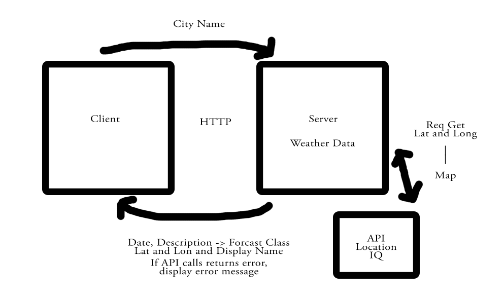

# city-explorer-api

**Author**: Gina Hobbs
**Version**: 1.0.0 (increment the patch/fix version number if you make more commits past your first submission)

## Overview
This app provides a weather server for the front end city explorer application I built.

## Getting Started
This app must be cloned down; start the server by running node server.js

## Architecture
<!-- Provide a detailed description of the application design. What technologies (languages, libraries, etc) you're using, and any other relevant design information. -->

## Change Log
<!-- Use this area to document the iterative changes made to your application as each feature is successfully implemented. Use time stamps. Here's an example:

01-01-2001 4:59pm - Application now has a fully-functional express server, with a GET route for the location resource. -->

## Credit and Collaborations
The TA's were very helpful in coaching me through this assignment.

Name of feature: This entire app

Estimate of time needed to complete: 5 hours

Start time: 3:45 pm

Finish time: 7:45 pm

Actual time needed to complete: 5 hours